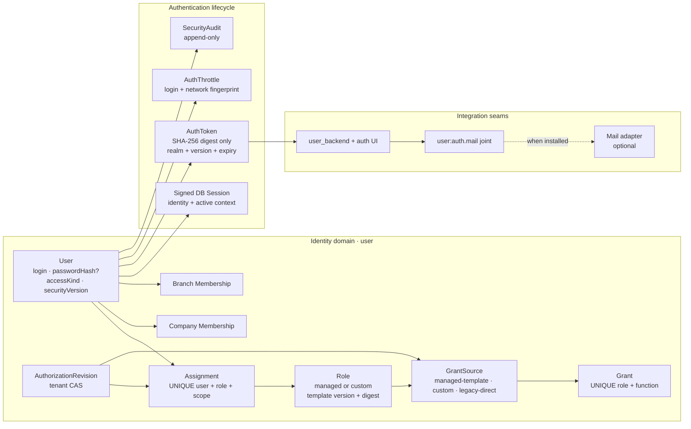
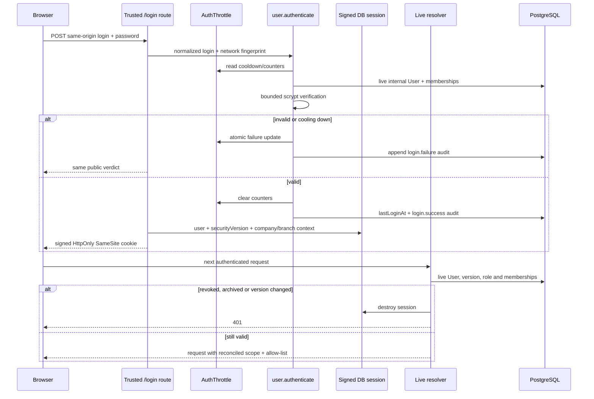
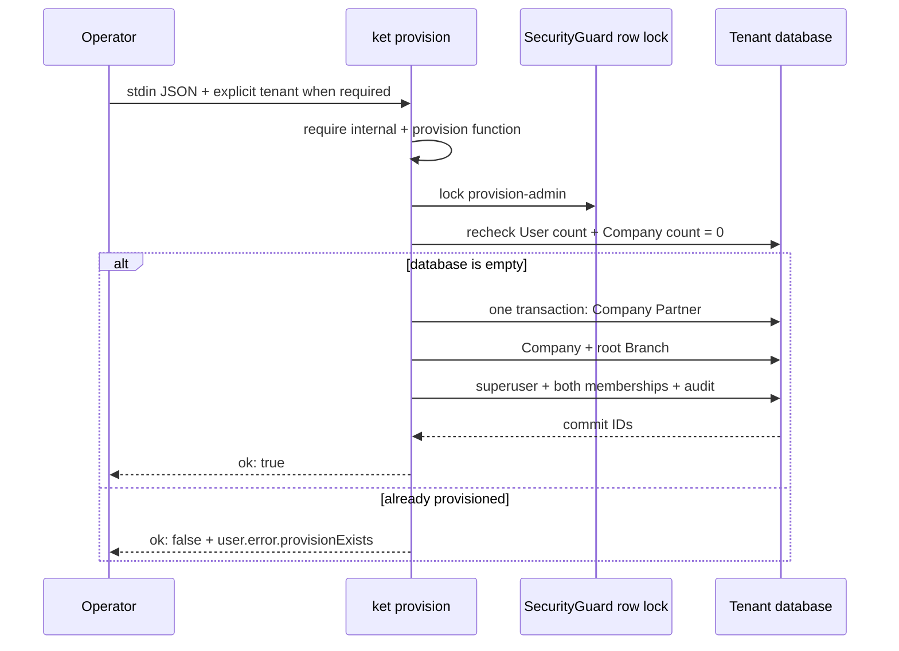

# Authentication và Users

Tài liệu này mô tả identity realm nội bộ được port từ the domain contract vào KetSuite: User,
Role, session, invitation/reset token, login protection, security audit và UI quản
trị. KetSuite giữ kiến trúc User tách Partner, quyền theo function allow-list và
company/branch scope; không sao chép `_inherits`, model-level CRUD grants, record rules
hay implied groups của the domain contract.

Source chính:

- `packages/ketsuite/src/modules/user` — domain User, Role và authentication;
- `packages/ketsuite/src/modules/user_backend` — UI quản trị, hồ sơ và token lifecycle;
- `packages/ketjs/src/server/session.ts` và `sessionstore.ts` — session primitives;
- `packages/ketjs/src/server/boot.ts` — live identity/permission resolution;
- `packages/ketsuite/src/ui/auth.tsx` — màn hình nhận invitation/reset trung lập.

## Administrative change reasons

User, role, workplace and emergency-access mutations accept an omitted `reason`.
Their forms do not ask the operator to write an explanation. The server still records
actor, target, scope, source, outcome and before/after digests automatically. Existing
API clients may send a reason as optional historical metadata; the absence of that
text must not bypass permission, expiry, revision or idempotency checks. This policy
does not apply to business reasons in other domains such as cancelling an invoice.

## Phạm vi

Cụm này cung cấp:

- tài khoản nội bộ với login chuẩn hóa, password hash nullable và access realm rõ ràng;
- managed/custom Role, source-aware Grant và assignment theo tenant/company/branch;
- session được xác thực lại ở mỗi request bằng `securityVersion` và membership live;
- đổi mật khẩu bản thân, thu hồi session và last-superuser guard;
- invitation 144 giờ, reset 4 giờ, token digest-only và single-use bằng CAS;
- PostgreSQL rate limit dùng chung nhiều pod và security audit append-only;
- named Mail integration joint, không tạo SMTP/outbox/template giả;
- bootstrap một lần qua `ket provision user.provisionAdmin`, password chỉ đi qua stdin;
- UI Users, Roles, permission presets, membership, profile, active sessions và token acceptance;
- toàn bộ domain error qua message catalog tiếng Việt/Anh.

Website signup/portal UI, API key, passkey, MFA/TOTP và hạ tầng gửi mail chưa nằm
trong phạm vi. OAuth/OIDC backend realm được triển khai ở module KetSuite riêng và
được mô tả tại [OAuth and OIDC](../oauth-oidc/). `portal`/`public` đã là access
kind hợp lệ nhưng không được đăng nhập vào backend realm.

Zitadel or another external IdP is an authentication authority only. KetSuite maps a verified external
identity to a local `user.User`, then resolves company membership, branch membership, scoped roles, bundles,
and exact function grants from KetSuite rows. IdP role/group claims are never an authorization source.

## Kiến trúc



## User và credential

`user.User` là identity riêng, chỉ liên kết tùy chọn tới Partner. Các field bảo mật:

| Field | Ý nghĩa |
|---|---|
| `login` | NFKC, trim và lowercase trước mọi lookup; unique ở database |
| `passwordHash` | scrypt có tham số trong chuỗi; nullable khi chờ invitation |
| `accessKind` | `internal`, `portal` hoặc `public`; backend chỉ nhận `internal` |
| `securityVersion` | tăng khi login/password/active/access kind thay đổi |
| `lastLoginAt` | lần đăng nhập backend thành công gần nhất |
| `active` | archive vô hiệu hóa từ request kế tiếp |
| `superuser` | bypass allow-list; luôn bảo vệ superuser hoạt động cuối cùng |
| `superuserOwner` / `superuserReason` / `superuserExpiresAt` | break-glass owner, reason, and expiry; null expiry is bootstrap compatibility only |

Không function output nào khai báo `passwordHash`, nên projection của engine không
thể trả hash ra HTTP hoặc agent tool ngay cả khi handler vô tình giữ cả row.

Parser scrypt giới hạn `N`, `r`, `p`, kích thước salt/hash và yêu cầu `N` là lũy
thừa của hai trước khi cấp phát. Login không tồn tại vẫn chạy dummy verification
hợp lệ để không tạo đường timing enumeration. Hash cũ được rehash sau login thành
công khi policy thay đổi.

## Login và live session resolution



`user.authenticate`, `user.prepareContext`, `user.resolveSessionContext` và token
consumer là function `internal`; generic function HTTP endpoint và agent descriptor
không công khai chúng. Logged-in user vẫn có thể đi qua trusted route tương ứng,
nhưng không thể gọi thẳng generic endpoint để bỏ qua CSRF, safe redirect, throttle
hoặc session rotation.

Session store có `listUser`, `destroyUser` và `destroyUserExcept`. Đổi mật khẩu bản
thân giữ session hiện tại sau khi rotate credential và đóng các session còn lại;
admin archive/reset đóng tất cả. Logout chỉ nhận POST same-origin.

## Invitation và password reset

```mermaid
%% File: docs/src/content/docs/ketsuite/authentication-users.md
sequenceDiagram
  participant Admin
  participant Service as user.issueAuthToken
  participant DB as PostgreSQL
  participant Mail as user:auth.mail joint
  participant User
  participant Accept as /auth/invitation or /auth/reset

  Admin->>Service: user + invitation/reset
  Service->>DB: invalidate previous kind
  Service->>DB: store SHA-256 digest, realm, version, expiry
  alt Mail adapter exists
    Service-->>Mail: raw token once + metadata
    Mail-->>User: delivery owned by Mail team
  else no Mail adapter
    Service-->>Admin: one-time copyable link
  end
  User->>Accept: token + new password
  Accept->>DB: validate digest/realm/version/expiry
  Accept->>Accept: hash new password
  Accept->>DB: CAS consumedAt = null
  alt CAS wins
    Accept->>DB: bump securityVersion + append audit
    Accept-->>User: success; token cannot replay
  else already consumed
    Accept-->>User: stable invalid-token error
  end
```

Chỉ SHA-256 digest được lưu. Invitation hết hạn sau 144 giờ, reset sau 4 giờ theo
subset the domain contract. Token cùng user/kind thay thế token trước; token gắn auth realm và
`securityVersion`, nên thay đổi credential hoặc trạng thái làm token cũ mất hiệu
lực. CAS nullable dùng `IS NULL`, vì vậy hai pod tiêu thụ đồng thời chỉ có một pod
thắng.

## Rate limit và audit

`AuthThrottle` nằm trong PostgreSQL thay vì memory từng pod. Khóa logic gồm login
đã chuẩn hóa và network fingerprint đã hash; sau ba lần sai, cooldown tăng theo
cấp số nhân. Public response giống nhau cho login không tồn tại, sai mật khẩu và
tài khoản không thuộc backend realm.

`SecurityAudit` ghi login success/failure, password change, reset/invitation,
session revoke, context switch, role/grant/template/assignment mutation và break-glass.
Authorization events record actor key, target, source, scope, reason, before/after digest and monotonic
authorization revision in the same transaction. Bounded audit output omits free-form metadata; password, raw
token, password hash and raw external subjects are never returned.

## Permission bundles, roles, and scoped assignments

The runtime authorization unit remains the exact qualified function key. Modules declare stable bilingual
bundles and classify each grantable function with a risk and owner. A deployment composes those bundles into
versioned job-role templates. No action-name regex or IdP claim contributes to a new managed role.

`Role.mode` distinguishes managed and custom rows. Managed roles carry `templateKey`, version, and digest;
they are read-only in the ordinary role editor. `GrantSource` records whether a materialized `Grant` came
from a managed template, tenant customization, or the compatibility path. Template upgrades replace only
their own source edges, preserve custom sources, preview effective and provenance changes, and use role plus
authorization revision CAS. Cloning a managed role creates an explicitly custom role and severs the link.

Assignments normalize one of these scopes:

| Scope | Effective boundary |
| --- | --- |
| `tenant` | Every current company membership, within its current valid branch context |
| `company:{companyId}` | Only the named live company membership |
| `branch:{companyId}:{branchId}` | Only that live branch inside that company |

The resolver re-reads user state, membership, assignment, role, grant, source, and compiled template health on
every request. Missing company context, revoked membership, a stale managed template, or an unknown function
fails closed. The `effectiveAccess` projection returns the same final set used by enforcement plus its scoped
assignment, role, source, and bundle paths. Its query count is bounded independently of the number of grants.

Legacy custom Role/Grant and unscoped Assignment calls remain compatible. Their sources are treated as
`legacy-direct`, and old assignments resolve as tenant scope. `legacyPermissionCatalogue()` and
`legacyPresetFunctions()` remain migration evidence only; product role templates must use exact bundle
declarations. See the [permission bundles and scoped roles RFC](/architecture/permission-bundles-rfc/).

Superuser remains the only escape hatch from the allow-list. Permanent null-expiry rows are reserved for
bootstrap compatibility. Operational elevation uses `setBreakGlass`, requires a live superuser actor, reason,
owner, future expiry, authorization CAS, idempotency, and an audit event. Expired break-glass access fails closed
without waiting for a session refresh.

## Provisioning lần đầu

`user.provisionAdmin` là function `internal + provision`; nó không có generic HTTP
endpoint, agent tool hoặc route UI. Chỉ lệnh `ket provision` gọi được function này
với actor hệ thống cố định. JSON đầu vào gồm tên/mã/currency của company và
login/tên/email/password của admin; toàn bộ JSON chỉ được đọc từ stdin bằng
`--input -`, vì vậy password không xuất hiện trong argv hoặc command history.



Hai invocation từ nhiều pod được serialize trên cùng guard row và recheck điều
kiện empty database sau khi lấy lock, nên chỉ một invocation có thể thắng. Mọi row
Partner, Company, Branch, User, membership và audit nằm trong một transaction;
lỗi ở bất kỳ insert muộn nào rollback cả guard row lẫn các row đã tạo. Khi app dùng
tenant databases, CLI từ chối chạy nếu thiếu `--tenant NAME` và chỉ migrate/call
trên adapter của tenant đã chọn.

Ví dụ vận hành:

```sh
# Run from: /path/to/ketjs
printf '%s' '{"companyName":"Ket Viet","companyCode":"KET","currency":"VND","adminLogin":"admin@example.com","adminName":"Administrator","adminEmail":"admin@example.com","adminPassword":"..."}' \
  | ket provision user.provisionAdmin --input -
```

Trong vận hành thật, dùng secret source hoặc prompt để sinh stdin thay vì ghi JSON
literal vào shell history như ví dụ minh họa.

## Interface công khai

### Domain functions

| Function | Exposure | Mục đích |
|---|---|---|
| `user.listUsers` / `getUser` | HTTP | User projection an toàn, membership, role và trạng thái credential |
| `user.createUser` / `saveUser` / `archiveUser` | HTTP | Quản trị lifecycle và security-version rotation |
| `user.listRoles` / `getRole` / `saveRole` | HTTP | Managed/custom role, health, assignment count and compatibility editing |
| `user.permissionBundleCatalogue` / `authorizationState` | HTTP | Compiled catalog/digest and CAS revision |
| `user.previewRoleTemplate` / `applyRoleTemplate` / `cloneManagedRole` | HTTP | Versioned managed-role workflow with source-aware diff |
| `user.assignScopedRole` / `unassignScopedRole` | HTTP | Idempotent tenant/company/branch assignment |
| `user.effectiveAccess` | HTTP | Final enforced functions with scoped provenance and health issues |
| `user.listAuthorizationAudit` | HTTP | Bounded digest-only authorization audit projection |
| `user.setBreakGlass` | HTTP | Audited owner/reason/expiry superuser activation or revocation |
| `user.grantFunction` / `assignRole` | HTTP | Custom/legacy compatibility edges |
| `user.permissionCatalogue` / `applyPreset` | HTTP | Legacy migration UI and User/Manager evidence |
| `user.authenticate` | internal | Backend authentication sau trusted `/login` |
| `user.setPassword` | internal | Đổi mật khẩu actor-bound sau trusted profile route |
| `user.issueAuthToken` | internal | Phát hành secret một lần cho admin/Mail joint |
| `user.consumeAuthToken` | internal | Invitation/reset single-use sau trusted auth route |
| `user.resolveSessionContext` | internal | Reconcile live User, version và membership mỗi request |
| `user.recordSecurityEvent` | internal | Append audit từ trusted auth/context routes |
| `user.provisionAdmin` | internal + provision | Bootstrap nguyên tử Company, root Branch và superuser đầu tiên |

### Engine/session primitives

- anonymous/internal functions vẫn gọi được từ trusted route khi browser đã login;
- generic endpoint trả `E_FUNCTION_INTERNAL` cho internal function;
- compare-and-set hỗ trợ expected nullable bằng SQL `IS NULL`;
- session store liệt kê/thu hồi theo User trên memory và PostgreSQL;
- session credential version được rotate nguyên tử.

### Mail joint

Joint `user:auth.mail` nhận `userId`, `kind`, raw `token` và `expiresAt`. Core không
biết schema, endpoint, SMTP, outbox hoặc template của Mail team. Khi chưa có fill,
UI nói rõ integration chưa tồn tại và chỉ cho admin sao chép link một lần.

## Giao diện quản trị

Module `user_backend` cung cấp:

Các route gán và gỡ vai trò theo phạm vi kiểm tra cấu trúc form trước khi gọi workflow phân quyền. Khi submit
bị từ chối, form giữ nguyên lý do mà quản trị viên đã nhập, đánh dấu đúng control chịu trách nhiệm và không
đưa các thao tác chỉ dùng để điều hướng vào schema. Vai trò vẫn do hệ thống định nghĩa; UI chỉ hiển thị các
gói quyền thay vì function key.

- `/admin/users` và form create/detail;
- company/branch/role membership management;
- invitation/reset action và one-time link state;
- active session list và revoke action;
- `/admin/roles`, form Role và permission groups;
- `/admin/permission-presets`;
- `/admin/profile` với credential change và session list;
- `/auth/invitation` và `/auth/reset` ở auth shell riêng.

Menu/action được lọc theo quyền thật. Profile của chính User đi qua actor-bound
trusted route, nên không cần cấp quyền quản trị User chỉ để tự đổi mật khẩu.

Mọi màn hình đã được mở qua HTTP bằng trình duyệt thật ở desktop 1440×1000 và
mobile 390×844, tiếng Việt/Anh. QA bao gồm populated/empty session, validation
error, permission-filtered menu, no-Mail state, keyboard focus, console error và
horizontal overflow. Không có console error hoặc viewport overflow.

## Kiểm thử theo phạm vi

`test/user-auth.test.ts` kiểm tra login normalization, backend realm,
actor-bound password, last-superuser guard, token TTL/replacement/CAS, DB throttle,
audit secret hygiene và scrypt bounds. `test/user-auth-e2e.test.ts` đi qua
HTTP thật cho admin/profile screens, token acceptance, session rotation và generic
internal-function protection.

`test/pg-live.test.ts` dùng PostgreSQL và hai adapter độc lập để mô phỏng nhiều
pod, kiểm tra unique login/assignment, single-use token và rate-limit counter dưới
concurrency, đồng thời dùng bốn adapter tranh bootstrap để xác nhận chỉ một kết quả
thắng. `test/user-provision.test.ts` kiểm tra empty database, second run,
actor, mã i18n và rollback toàn transaction. `test/user-provision-cli.test.ts`
kiểm tra stdin secret hygiene, exit code và tenant selection. Engine/session
regressions nằm trong `engine-primitives.test.ts` và `session.test.ts`.

Theo `AGENT.md`, local chỉ chạy test đúng phạm vi thay đổi. Full suite chạy trên CI
khi PR release target `master`.

## Benchmark PostgreSQL

`bench/identity-auth.bench.ts` dựng schema/fixture trước, warm up workload tuần tự,
rồi dùng monotonic clock đo từng operation. Kết quả báo `p50`, `p95` và throughput;
build, migration, seed và password hash lúc tạo fixture không nằm trong mẫu.

Workload chung chạy cùng một harness trên `origin/develop` và code PR:

- authenticated `user.listUsers` call;
- permission resolution;
- live session resolution;
- successful login KDF;
- idempotent existing role assignment.

Workload mới chỉ có ở PR đo tám request cùng tranh một Role membership và bốn
request cùng tiêu thụ một token single-use. Correctness assertion tương ứng nằm ở
PostgreSQL integration test; benchmark tập trung vào latency/throughput.

```sh
# Run from: /path/to/ketjs
KET_BENCH_PG=postgres://... npm run bench:user-auth
```

Baseline dùng `KET_BENCH_KETSUITE_MODULE` trỏ tới bản build sạch của
`origin/develop`, nên hai phía dùng cùng benchmark, Node.js, engine, PostgreSQL và
máy chạy. Benchmark phải chạy lại ngay trước commit; tăng quá 15% p95 hoặc giảm quá
10% throughput phải được tối ưu hoặc giải trình trong PR.

### Automatic access policies

`user.AccessPolicy` matches trusted `user.DirectoryFact` values for a directory group, department or job title and grants healthy managed roles at a tenant, company or branch scope. The directory adapter calls the internal `user.replaceDirectoryFacts` as `system:user-directory`; browsers cannot submit directory facts. The policy editor offers existing directory values and retains an existing condition when its directory value disappears.

`user.PolicyAssignment` owns each policy's edges separately from manual `user.Assignment` rows. Pausing, changing or removing a match removes only the affected policy's grants. Memberships are never created by a policy. Matches without a valid workplace appear as blocked. Effective permission resolution unions policy and manual grants and still checks active user, company, branch, membership and managed-role health.

Preview performs no writes. Save/pause use an actor-bound idempotency record and authorization-revision compare-and-set in the same transaction as assignments and security audit. The UI includes the preview digest so a changed rule or changed preview result is refused. Interactive changes to the actor's own authority and security-role changes by non-superusers are refused on the server. Optional audit reasons are never required.

Directory replacement reconciles synchronously. The scheduled `user.reconcileAccessPolicies` job reconciles changes to memberships and role health every minute, with a revision change only when edges differ. Revocation takes effect at permission resolution even before a stale edge is removed. Workers must run for new matching memberships to acquire grants without another directory update. Inactive or unhealthy roles stop granting; policies do not silently repair or upgrade them.


### Administration language

The user interface describes work, workplaces and the source of an assigned role in both Vietnamese and English. Managed-role versions, function keys and grant-source internals are not primary navigation. Added/removed access is the primary preview; counts and technical coverage remain an optional disclosure. Account delivery copy distinguishes an email request from delivery and activation, and distinguishes an external temporary password from a local verification code. System audit records remain intact when optional reason inputs are removed.

### Reading a standard role

The managed-role record shows two navigation items: allowed actions and people. Its title and health appear once in the modal header. It presents named business actions rather than template versions, grant provenance or a separate screen-diagnostics tab. A stale role gives a support-oriented notice. The diagnostic model remains available to trusted tooling; the product-facing managed catalogue is read-only.

### User record navigation

A user's record has Overview, Access, Sign-in and Log navigation. The Access panel groups assignments by workplace and distinguishes direct assignments from automatic rules. “Check access” opens a nested diagnostic dialog rather than another primary tab. The shared record runtime owns its inert parent, close flow, scroll and return focus. The actor's own authority and non-editable policy assignments do not expose direct grant/removal controls.

### Reviewing an access change

Assignment and removal previews lead with the named work that becomes available or is taken away. Technical bundle counts and per-screen coverage are inside an optional disclosure. Workplace edits preview assignments that will be removed before saving. The runtime invalidates a preview when its form changes; saves still use the server's authorization-revision check, preserving inputs on refusal.

### Emergency access

Emergency access is inside the Access panel's advanced disclosure. Only a fully authorized administrator may grant or revoke it, never for their own account. Granting requires an expiry and confirmation; the server owns these guards and writes the audit. The overview can show an active expiry without exposing emergency controls to a read-only viewer.

### Sign-in assistance

The Sign-in panel distinguishes invitations for a person who has not activated their account from password recovery. Deployment adapters can offer email, a one-time credential or both. A pending or failed external account shows its preparation status and an explicit status/retry action. Email acknowledgement is shown separately from activation; it never sets `passwordReady`. External adapters must supply verified identity state instead of inferring it from the local password hash. Temporary passwords are only displayed from the one-time claim response and disappear on leaving that layer.

### Choosing an automatic rule

The automatic-role collection uses the shared list/search composition and a URL-owned record modal. Rule conditions choose from directory-provided group, department and job-title options. Switching condition type clears an incompatible draft value; an existing saved value remains visible even when it has disappeared from the latest directory snapshot. An empty directory explains what is missing rather than asking an administrator to invent an identifier. Changes are previewed before the save action appears.

### Managed catalogue boundary

`/admin/roles` lists managed roles and has no create or clone action. Its modal reads `user.managedRoleModalContext`, which refuses custom records and strips authoring permissions on the server. The older role-context and migration APIs remain available as explicit compatibility boundaries; they do not create a parallel product workflow. Assignment still validates managed-role health and security/self-edit restrictions independently of disabled UI controls. User-list create actions are also omitted when the actor cannot create an account.

Profile saves through `user.saveUser` accept an idempotency key. Retrying the same save replays the original result without overwriting a later edit. User function handlers are organized by capability under `user/functions/`.
