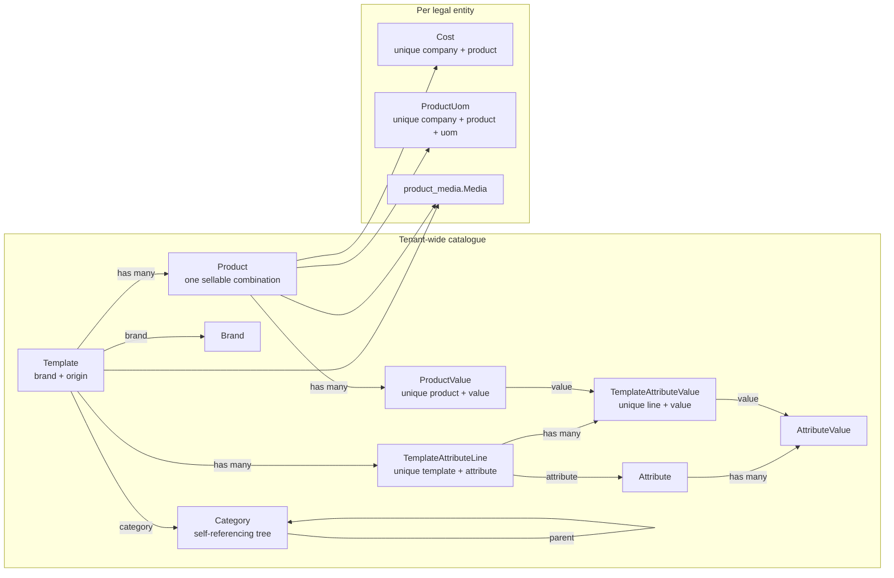

# Product

KetSuite Product is the catalogue every selling and stocking module reads from. It is master data:
one catalogue across the whole tenant, with the values that differ per legal entity — cost and
packaging — kept in company-scoped tables beside it.

## Modules

- `product`: categories, templates, variants, attributes, units of measure per product, and cost.
- `product_media`: ordered images for a template or a variant. Bytes and delivery stay with `storage`.
- `product_backend`: the admin screens and the sidebar entry. Auto-installs once both `product_media`
  and `backend` are present.
- `product_mail_backend`, `product_activity_backend`: chatter and activities on a template.
- `product_variant_mail_backend`, `product_variant_activity_backend`: the same for a variant.

`product` depends only on `uom`. A headless deployment gets the catalogue and its functions with no
admin UI, and installing the admin adds the screens without changing the domain.

## The template and variant split

A `Template` is the thing a person calls a product. A `Product` is one sellable combination of it —
what other systems call a variant. The name reads oddly and is kept deliberately, so the migration
from the domain contract maps one to one.



`ProductValue` is an explicit join rather than a hidden many-to-many: the framework has no magic for
one, and a join you can see is a join you can query, scope and migrate.

## Product type

`Template.type` is `goods` or `service` only.

The domain contract puts three values here — consumable, service, and storable. Storable is a stock
concept, and it would live in a module that must not know stock exists; uninstalling stock would then
leave a value behind that means nothing. KetSuite splits it honestly: `product` says physical or not,
and `stock` extends the template with whether it is tracked. The three original states still map one
to one — service, goods untracked, goods tracked — so a migration is mechanical.

## Company scope

`id` is a tenant-wide primary key, and the engine reads across every company in scope while writing
to exactly one. A company-scoped row therefore carries its company in its id:

| Model | Id | Unique index |
|---|---|---|
| `Cost` | `<company>:<productId>` | `(companyId, productId)` |
| `ProductUom` | `<company>:<productId>:<uomId>` | `(companyId, productId, uomId)` |

A derived id built only from the shared ids would collide between companies on the primary key, and a
lookup that ignores the company finds a row it can never write — the update then filters that row out,
changes nothing, and reports success. Every read of these two models is narrowed to the active company
before it reaches a screen or a write.

## Attribute management

`/admin/product/attributes` uses the shared collection table: compact search across attribute and value
names, display-type and variant-policy filters, pagination, column controls and a create action beside the title. Each row previews up to three
values and opens `product.attribute` in a record modal over the current collection URL.

The single-view modal edits the name, display type, variant policy and ordered values together. The
public `ReorderList` supports drag-and-drop and move-up/down buttons; color attributes expose an
optional `AttributeValue.htmlColor` value. Structural edits and field drafts survive view changes and
validation refusals, and closing a changed record asks before discarding it.

`product.attributeModalContext` checks read/create permissions and returns the complete ordered draft.
`product.saveAttributeDraft` requires configuration permission and saves the parent and values in one
transaction. An attribute may have no values. Supplied values must have distinct, nonblank names;
colors use six-digit hexadecimal notation. Existing value IDs remain stable. Values referenced by a
template cannot be removed, and an attribute used by a template cannot change its variant policy.
The legacy POST endpoints remain available for compatibility; the modal uses the atomic command.

Focused coverage lives in `test/product-attribute-draft.test.ts`, `test/product-attributes-screen.test.tsx`
and the attribute modal and reorder-list tests.

## Variants

`generateVariants` takes the cartesian product of the template's attribute lines, skipping attributes
marked `no_variant`. Each generated variant gets a `combinationKey` — the value ids in a stable order —
and an id derived from it, so regenerating is idempotent. Combinations no longer valid are archived
rather than deleted; they may already be on documents.

A variant has no name of its own. It *is* its combination, so the name is derived from the attribute
values rather than stored, and `listVariants` and `getVariant` return it alongside `values`:

```jsonc
// File: examples/product-variant-name.jsonc
{
  "id": "tpl-jacket:color-blue",
  "combinationKey": "color-blue",
  "name": "Xanh nghiệp vụ",
  "values": [{ "attribute": "Màu sắc", "value": "Xanh nghiệp vụ" }]
}
```

`saveVariant` creates one by hand. It only ever writes `combinationKey` on the way in, or when a
caller names it explicitly: casting it on every edit meant setting a barcode on a generated variant
replaced its combination with a manual key and silently unhooked it from its values.

A template with no configured variant combination still owns one implicit `Product` whose
`combinationKey` is empty. Product-level SKU and barcode edit that default variant. The admin hides it
from the variant table because it is an implementation detail, not a choice the reader can sell. As
soon as real combinations exist, the default variant becomes inactive and the template form keeps its
SKU and barcode read-only with an explanation; identity then belongs on each visible variant.

Brand and origin are template fields. Brand is a managed relation, so another module can reuse the
catalogue without copying brand names into free text; origin remains text because no country-of-origin
catalogue is required by the product domain.

The template record page loads its Attributes & variants editor as the nested `product.variant-editor`
island. `tools/build-backend-client.mjs` bundles `ui/client/variant-editor-view.tsx` into the product
backend's `client/variant-editor.mjs` asset on every build. The product modal context tests verify that
every declared product island client is served, including clients loaded only after switching tabs.

The Attributes & variants tab uses the shared `RelationSelect` to search and add existing attributes,
excluding those already on the template. Its dropdown also offers Create attribute to users with both
`product.saveVariantSetup` and `product.saveAttributeDraft`, carrying the search text into the inline
creation form. The form accepts a name and one value per line, saves the shared
attribute and its values atomically, then selects them in the current template draft. Existing
unsaved attribute lines and variant rows stay intact. The template's Save applies that draft;
discarding it does not delete the shared attribute. Validation and network failures keep the form
open with its input, and retries reuse the same attribute and value identifiers.

The tab reads as two steps. Step 1 lists one line per attribute: a checkbox group of the attribute's
catalogue values, where ticked values are the ones this template is sold in, a Select all action, and
a remove action. Each line's price extras sit in a closed disclosure whose summary names the extras
already set; a value that is not a number keeps the disclosure open and blocks Save. Unticking a value
does not delete the variants that use it — their rows become incomplete until the user archives them or
picks another value, and ticking the value again restores its saved extra. Step 2 names the missing
combinations in a notice with one Create action, then lists one compact row per variant: its
combination as text, SKU, status, and computed price. Edit opens the row in place, with `aria-expanded`
on the toggle, to change its combination, codes, measures, and image. Saving is still the record
header's Save; Reset in the tab footer restores the last saved setup.

## Units of measure

A template has one default unit. `addProductUom` adds an alternate packaging unit for a variant, and
`setProductUom` replaces the set with at most one — which is what the variant form's single select
means. Both refuse a unit that does not share a root with the template's default, because a conversion
across unit trees has no meaning.

The admin holds the picker to that tree rather than reporting the constraint after a submission: the
unit list is filtered by root, and a unit created from the picker's dialog is parented into the same
tree.

## Media

`product_media.Media` is company-scoped ordered image metadata. Exactly one of `templateId` or
`productId` is set. A unique index on `(companyId, primarySlot)` enforces one primary image per
target in the database rather than in application code.

`listPrimaryMedia` returns the primary image of many targets in one call — a catalogue page shows a
thumbnail per row, and one call per row would be one query per product plus every image none of them
needs.

## Backend screens

`product_backend` owns both the sidebar entry and the pages it points at; a bridge that contributed
only a button would ship a link to a 404.

| Route | Screen |
|---|---|
| `/admin/product/templates` | Catalogue, list and kanban, with search, filters, grouping and saved searches |
| `/admin/product/templates/new` | Create, on the template record page |
| `/admin/product/templates/{id}` | Template record page: general, attributes and variants; `?tab=media` is the server-rendered images page |
| `/admin/product/templates/{id}/variants/{variantId}` | Variant detail |
| `/admin/product/attributes` | Attributes and their values |

Catalogue rows, kanban cards, global search results and the create action open a template on its
record page (`product.template-page`), a client-rendered `RecordPage` (see
[Record pages](/ketsuite/record-modal/#record-pages)). The page's header carries Save, More and
**Back to list**; there is no breadcrumb. `?record=product.template:<id>` links from the earlier modal
redirect to the page.

Reference fields are relation pickers — a select with a search dialog that can also create the record
it is missing — rather than bare selects. The list functions behind them accept `search` and `limit`,
which is what a picker sends on every keystroke.

Everything the list is doing is in the URL: which page, which search, which view, which columns. The
back button and a shared link keep their meaning, and nothing holds state between requests.

Every mutating route refuses a cross-origin POST, and the two detail screens support a partial save
that replaces the record header and body while chatter, activities and the save controller keep their
DOM and their local state.

The template detail has three tabs only: general, attributes and variants, and images. Secondary or
destructive record actions such as archive live in the header's **More** menu instead of consuming a
form section. Variant rows are paged by ten; variant-image rows are paged by 25. On desktop record
forms use inline labels and controls, while the same fields stack on narrow screens.

## Verification

```bash
# Run from: /path/to/ketjs
npm run build
node --test .build/test/product.test.js \
  .build/test/product-media.test.js \
  .build/test/product-stock.test.js \
  .build/test/product-stock-e2e.test.js
```

`product-stock-e2e.test.ts` boots a real app over HTTP and walks units, variant generation, media
upload and download, pricing and the admin routes. Browser acceptance runs against a seeded fixture
server:

```bash
# Run from: /path/to/ketjs/e2e
npm run test:product
```

The browser suite renders every screen at desktop 1440×900 and mobile 390×844 in both Vietnamese and
English, asserts no horizontal overflow and a consistent control height, and drives create, atomic
save, attribute and variant flows and media management.

## Extension points

`product` contributes no UI and knows nothing about stock, sales or accounting. Other modules reach it
through its functions and through named joints on the admin screens:

- `product_backend:template.media` and `variant.media` for extra image tooling;
- `template.collaboration` and `variant.collaboration`, which the mail and activity bridges fill;
- `template.editor` and `variant.editor` for the progressive save controller;
- `media.upload` for the upload control itself.

`stock` extends the template with storability and tracking through its own configuration function, so
uninstalling it takes its fields and its part of the form with it.
